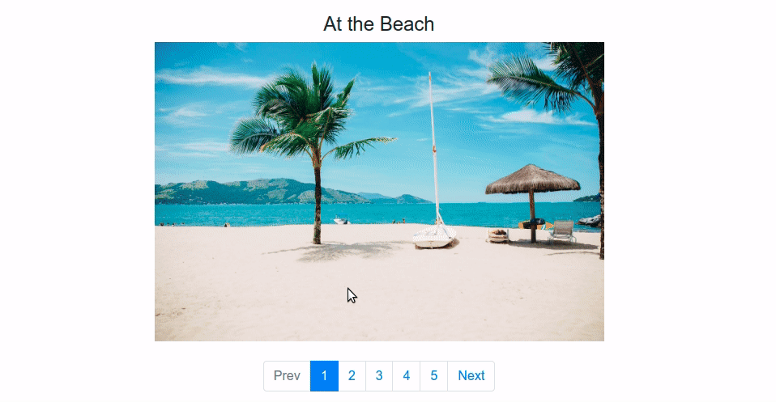

# Pages

This project was generated with [Angular CLI](https://github.com/angular/angular-cli) version 9.1.15.

## Installing and Development server

[1] - Clone this repo.

[2] - Inside this project folder run `npm install`.

[3] - Run `ng serve` or `npm start` for a dev server. Navigate to `http://localhost:4200/`. The app will automatically reload if you change any of the source files.

